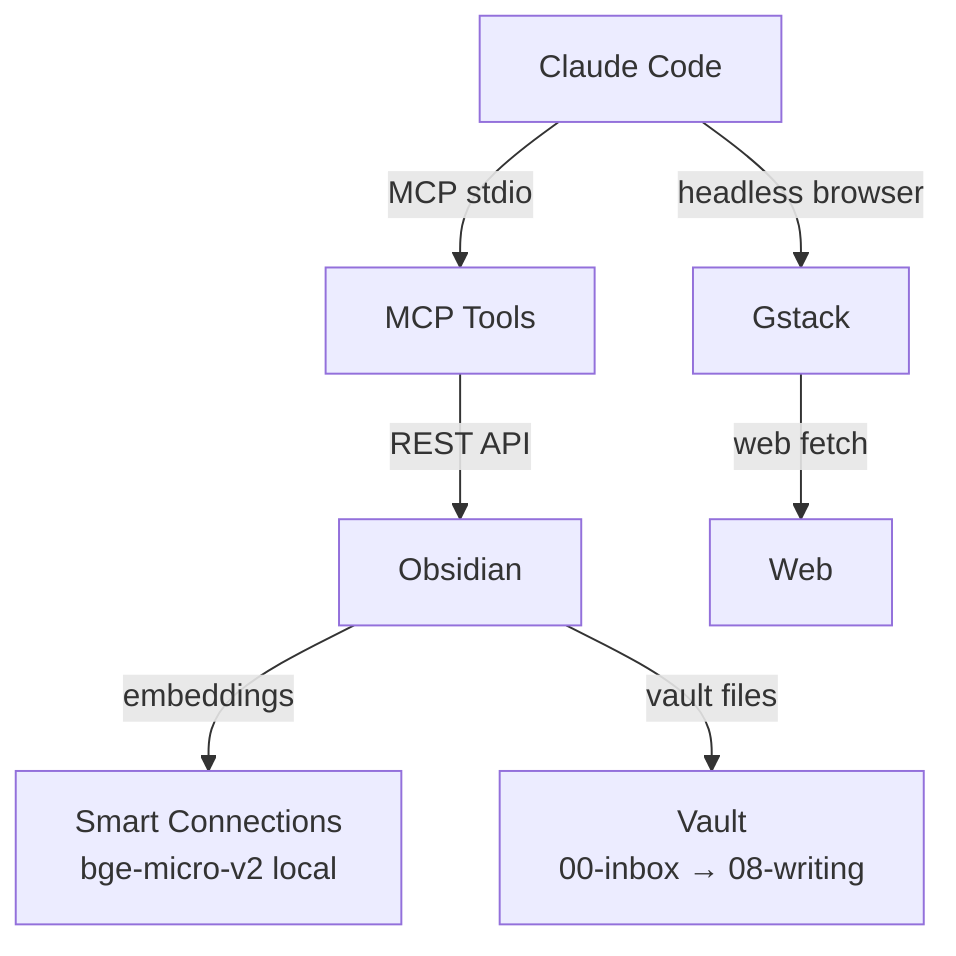
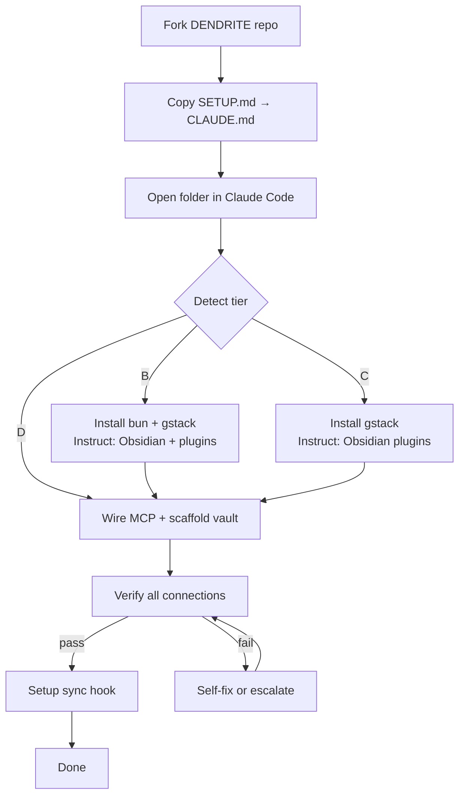

# DENDRITE

> *Feed it signals. Watch it branch.*

Claude Code + Obsidian + Gstack — wired together into a local-first, semantically searchable personal knowledge system. Self-installs from a single file.

---

## What You Get

- **Ask Claude about any idea you've ever captured** — semantic search finds it, no keywords needed
- **Claude reads and writes your vault natively** — no copy-paste, no context-switching
- **Everything stays local and private** — no cloud, no subscriptions, your data yours
- **Your setup syncs back to your repo automatically** — evolves as you do

---

## The Difference

**Without DENDRITE**
```
You → copy-paste notes into Claude → hope it's the right one
You → keyword search Obsidian → scan 40 results manually
You → switch apps to research → copy back into Claude
You → re-explain your setup every session
Claude → forgets everything when the session ends
```

**With DENDRITE**
```
You → ask Claude anything in plain English
Claude → semantic search finds the right note instantly
Claude → reads, writes, and links your vault natively
Claude → fetches the web inline without leaving your terminal
Claude → remembers through your vault — forever
```

| | Without | With |
|---|---|---|
| Finding notes | Keyword search + manual scan | Plain English → semantic match |
| Using notes with AI | Copy-paste every time | MCP reads vault directly |
| Token cost | Load entire files | Search-first, load only what's needed |
| Web research | Switch apps | Gstack fetches inline |
| Memory | Resets every session | Vault persists forever |
| Keeping setup current | Manual | Auto-syncs to your fork |

---

## Architecture



---

## Setup in 3 Steps

**1.** Fork this repo

**2.** Copy `SETUP.md` → rename it `CLAUDE.md` → drop it in an empty folder

**3.** Open that folder in Claude Code — it does the rest

<details>
<summary>What Claude Code will do (click to expand)</summary>

- Detect your tier (what's already installed)
- Install bun and gstack automatically
- Guide you through Obsidian + plugin installation step by step
- Scaffold your vault (9 folders + templates + system files)
- Wire the MCP server so Claude reads your vault natively
- Verify every connection is live — fix errors automatically
- Set up auto-sync back to your fork on every Claude Code session

</details>

---

## Setup Flow



---

## Staying Updated

Your local architecture changes — new templates, vault tweaks, CLAUDE.md updates — sync back to your fork automatically every time you open Claude Code.

---

## Troubleshooting

See [docs/troubleshooting.md](docs/troubleshooting.md)
